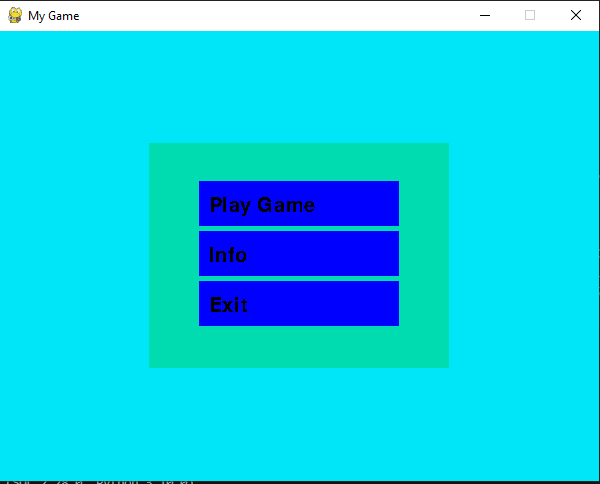
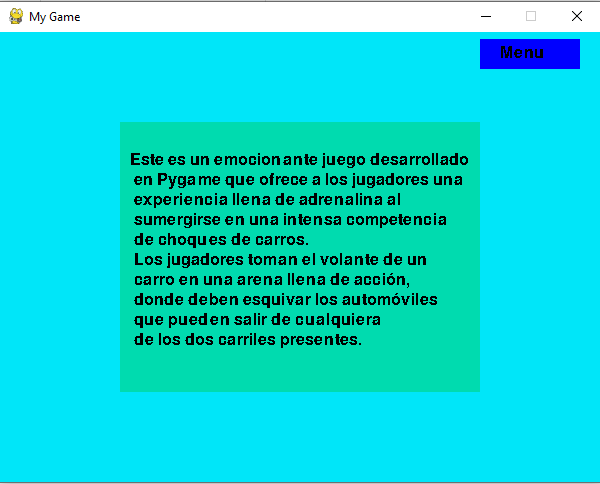
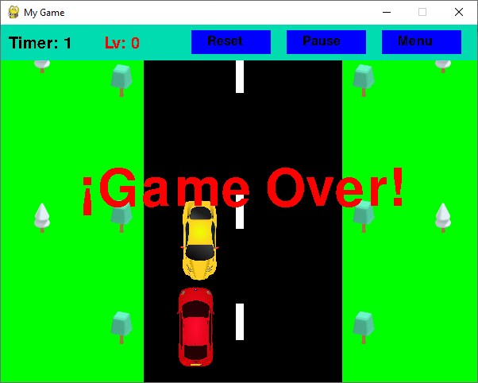

# My-Game

## Introducción
Este es un emocionante juego desarrollado en Pygame que ofrece a los jugadores una experiencia llena de adrenalina al sumergirse en una intensa competencia de choques de carros. Los jugadores toman el volante de un carro en una arena llena de acción, donde deben esquivar los automóviles que pueden salir de cualquiera de los dos carriles presentes.

El objetivo principal del juego es sobrevivir y subir de nivel mientras se evita chocar contra los otros carros. Utilizando las teclas de flechas del teclado (izquierda y derecha), los jugadores pueden maniobrar su carro para evadir los carros enemigos y escapar de situaciones peligrosas. Cada vez que se suba de nivel la velocidad de los carros enemigos aumenta, por lo tanto, la dificultad del juego también lo hace.

## Características del juego
* El juego está compuesto por:
  - El menu principal.
    
  - Tablero de información.
    
  - Tablero de juego.
    

## Versiones
* 1.0

## Tecnologías utilizadas
* [Python 3.10.0](https://www.python.org/) Python es un lenguaje de alto nivel de programación interpretado cuya filosofía hace hincapié en la legibilidad de su código, se utiliza para desarrollar aplicaciones de todo tipo.
* [PyGame](https://www.pygame.org/) Pygame es un conjunto de módulos de Python diseñados para escribir videojuegos. Pygame agrega funcionalidad sobre la excelente biblioteca SDL. Esto te permite crear juegos completamente funcionales y programas multimedia en el lenguaje Python.
* [Visual Studio Code](https://code.visualstudio.com/) es un editor de código fuente desarrollado por Microsoft. Es un entorno de desarrollo integrado (IDE) muy popular y ampliamente utilizado por desarrolladores de software en diversas plataformas, incluyendo Windows, macOS y Linux. Aunque es desarrollado por Microsoft, VS Code es de código abierto y gratuito.

